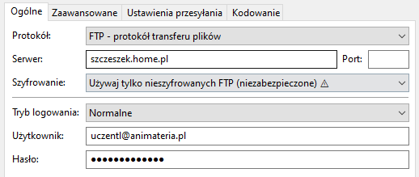
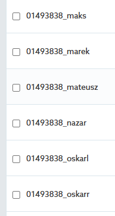
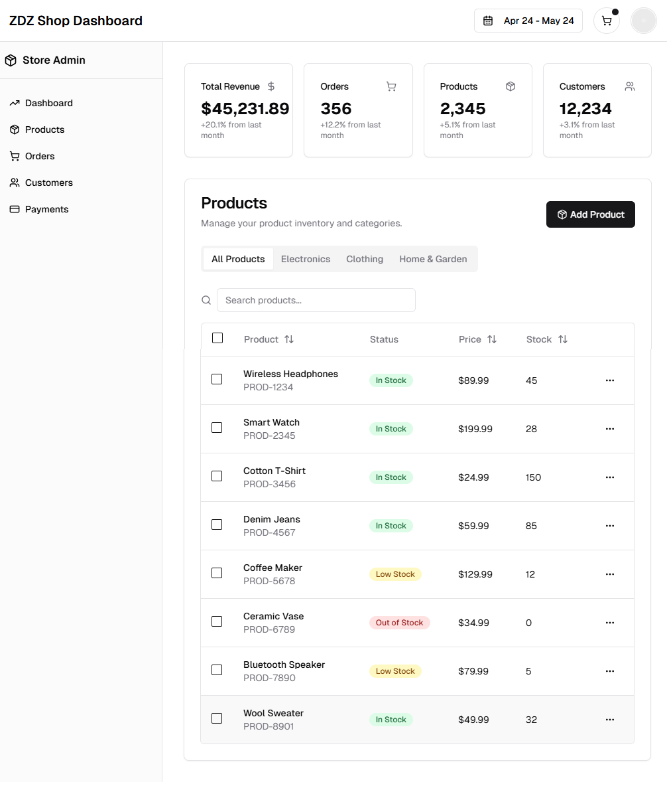

# 450 e-commerce

# PROJEKT PROSTEGO SKLEPU INTERNETOWEGO

## Przygotuj projekty sklepu internetowego zawierającego następujące moduły: [20h]

### 1.Projekt graficzny (wireframe) - [3h]
   
- logowanie/rejestracja
  
   
  
- reset hasła

  

- strona startowa/domowa, 
  
  

- strona kategorii (lista), strona produktu
- 
  
  

- koszyk/podsumowanie, płatność
  
    
  

### 2.ELEMENTY GRAFICZNE: [2h]
   
- logo [Create a Professional Brand With this Free AI Logo Generator (Vector)](https://www.youtube.com/watch?v=8hQLld0xFao)
- kolorystyka [Psychologia kolorów](https://fdc.org.pl/ciekawostki/psychologia-kolorow/#:~:text=W%20tym%20artykule%20zg%C5%82%C4%99bimy%20tajemnice%20psychologii%20kolor%C3%B3w%2C%20odkrywaj%C4%85c,sposoby%20na%20wykorzystanie%20ich%20mocy%20w%20codziennym%20%C5%BCyciu.)
- Hero section + CTA - [40 inspiring hero images examples](https://www.justinmind.com/blog/inspiring-hero-image-websites/)

### 3. Dodaj podstawowe elementy graficzne do wireframe'ów. [1h]

### 4.TEMATY:

- Marek: Jachty
- Krzysiek: części komputerowe
- Szymon: Samochody: https://osakr1109.github.io/szymonwe.github.io/samochody
- [Oskar R.](https://github.com/oskarrutkowski7/metalvault/): Płyty CD - https://oskarrutkowski7.github.io/metalvault/
- [Oskar L.](https://github.com/osakr1109/swiatkksiazek): Książki - https://osakr1109.github.io/swiatkksiazek/
- [Tomek](https://github.com/komareq1): Spotrtswear : https://komareq1.github.io/TomekK/
- Nazar: Czekolada - https://nazarboikod.github.io/chocopage/
- Maks: Gry komputerowe - https://maksymiliankl.github.io/htmlplik/mx.html
- Mateusz: (https://mateusz-muzyka.github.io/strona3W/web-content ) Merch growy - ()

### 5.TECHNOLOGIE:

- HTML
- CSS
- JS
- PHP
- mySQLi

### 6.KOMPONENTY / FUNKCJONALNOŚCI

- Produkt record
- Dialog window
- menu
- search
- breadcrumb
- pagination

### 7.Prototyp Front end HTML/CSS [3h]
- przygotuj publiczne repozytorium
- stwórz prototyp strony startowej (tylko tytuły sekcji) i zapisz jako index.html
- opublikuj prototyp w Github Pages
- dodaj podstrony i uzupełnij brakujące elementy zapewniając responsywność - HTML/CSS
- uaktualnij repozytorium i opublikowaną stronę

### 8. Back end [4h]

- Logowanie/Rejestracja (autoryzacja/autentyfikacja)
- Struktura danych (baza danych)
- Upload plików
- Wyszukiwanie / sortowanie / paginacja
- Koszyk

### 9. Publikacja 2025.04.28

WYMAGANIA:
- opublikowane na sewerze zdalnym min 2 podstrony (w tym system logowania/rejestracji i jedna dodatkowa podstrona) uywające działających skryptów PHP
- dostęp do kodu na github

PHPMYADMIN - https://szczeszek.home.pl/sql

### 10. Dashboard page 2025.04.29
- dodanie projektu graficznego do katalogu udostępnionego
- wykonanie podstrony w PHP uwzględniającej nastepujące funkcjonalności (co najmniej):
   - strona zabezpieczona (tylko dla admina)
   - dodawanie produktów (nazwa art., kategoria art. cena, ilośćw magazynie, cena, zdjęcie/zdjęcia)
   - usuwanie produktów
   - zaznaczanie grupy produktów (operacje na grupie)
   - sortowanie wg nazwy i wg ceny
  

# !iNFO
- [Pasja informatyki - PHP (BACK-END)](https://miroslawzelent.pl/kurs-php/)

# TOOLS
- [https://v0.dev/](https://v0.dev/)
- [figma.com](https://www.figma.com/)
- [penpot.com](https://penpot.app/)
