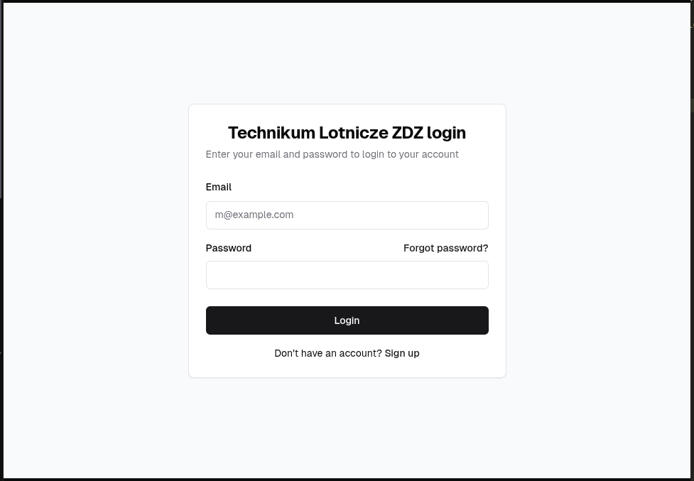
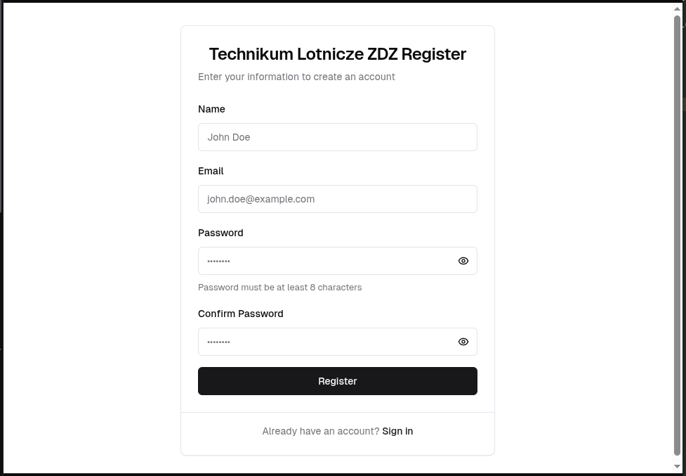
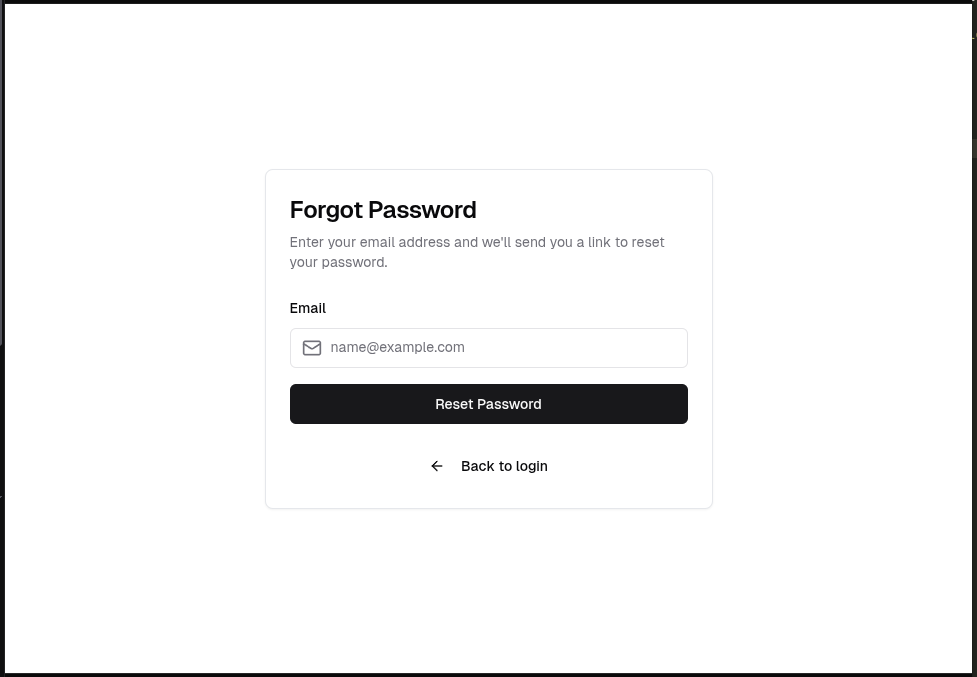
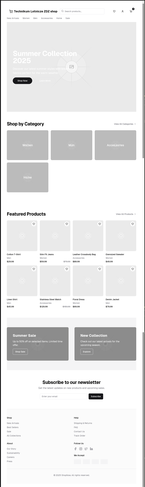
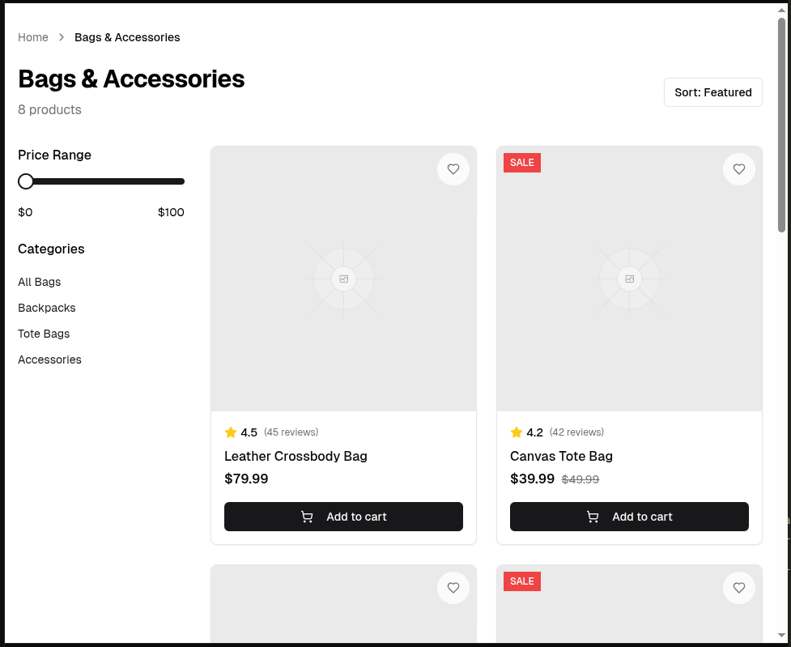
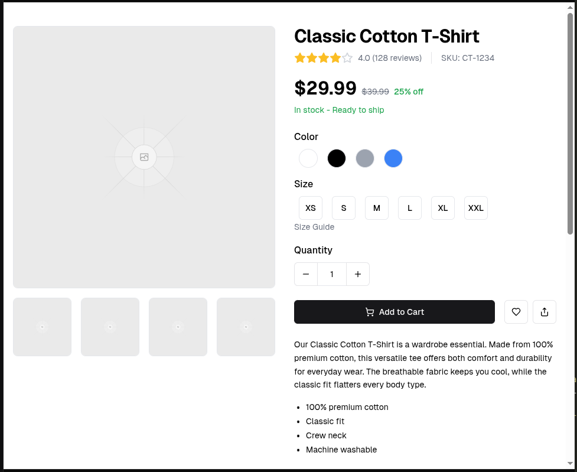
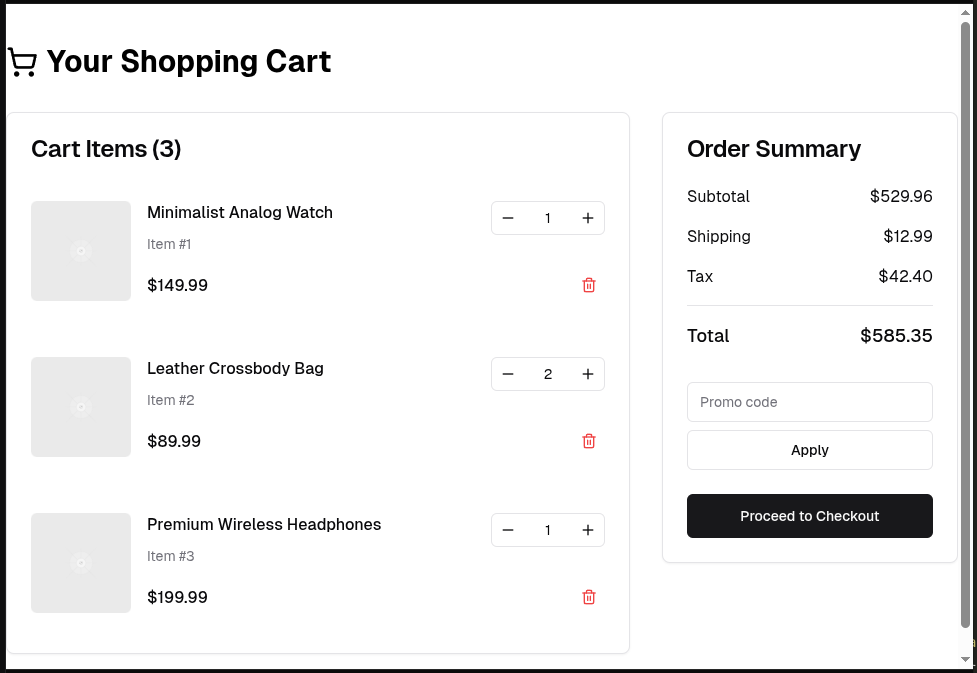
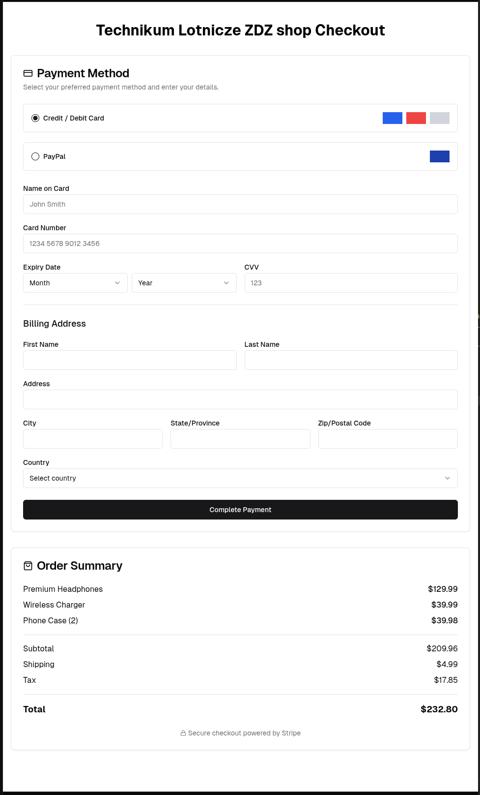

# 450-E-commerce

### PROJEKT SKLEPU INTERNETOWEGO

#### Przygotuj projekty sklepu internetowego zawierającego następujące moduły:

1.Projekt graficzny (wireframe)
   
- logowanie
   | width=400
- rejestracja
  
- reset hasła
  
- strona startowa/domowa
  
- strona kategorii (lista)
  
- strona produktu
  
- koszyk/podsumowanie
  
- płatność
  

2.ELEMENTY GRAFICZNE:
   
- logo
- kolorystyka [Psychologia kolorów](https://fdc.org.pl/ciekawostki/psychologia-kolorow/#:~:text=W%20tym%20artykule%20zg%C5%82%C4%99bimy%20tajemnice%20psychologii%20kolor%C3%B3w%2C%20odkrywaj%C4%85c,sposoby%20na%20wykorzystanie%20ich%20mocy%20w%20codziennym%20%C5%BCyciu.)
- Hero section + CTA

3.TEMATY:

- Marek: Jachty
- Krzysiek: części komputerowe
- Szymon: Samochody
- Oskar R.: Płyty CD

4.TECHNOLOGIE:

HTML/CSS/JS/PHP
mySQLi

5. KOMPONENTY / FUNKCJONALNOŚCI

- Produkt record
- Dialog window
- menu
- search
- breadcrumb
- pagination
